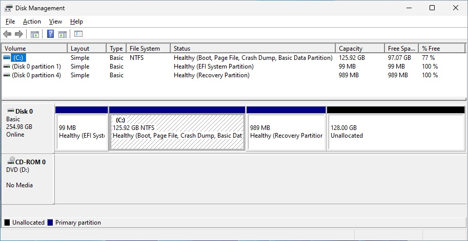
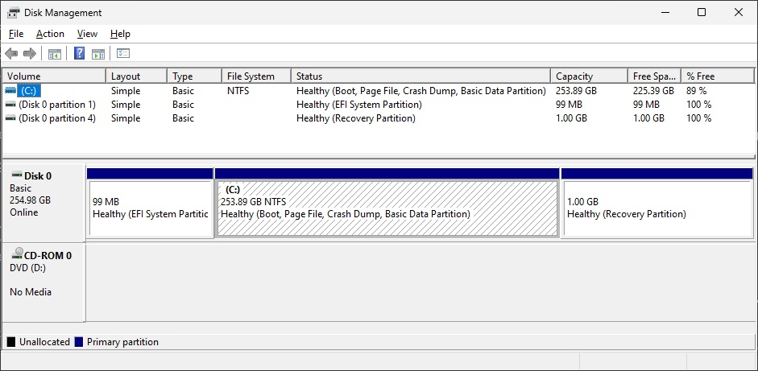

# MoveRecoveryPartition
 Setup/Repair a Windows Recovery partition.

If the Recovery environment is currently disabled:
- the user can identify ONE recovery partition located AFTER the system partition and this partition
  will be removed.
- if the Recovery environment is not available in System32\Recovery, it can be restored from the
  Windows distribution media (DVD, ISO, etc.)
- the system partition is extended to the maximum size permitted less the space required for the
  recovery partition.
- a recovery partition is created and the Recovery environment is enabled.

If the Recovery environment is currently enabled:
- the user can identify ONE recovery partition located AFTER the system partition.
- if no partition is selected, the script enumerates all Recovery partitions on the system disk.
- a backup of the selected partition is created: this includes all customizations of the existing
  partition.
- the system partition is extended to the maximum size permitted less the space required for the
  recovery partition.
- a recovery partition is created and the backup of the existing partition is restored.
- the BCD entries are updated.

On exit, the version information of the ACTIVE Recovery environment is displayed.

To move the Recovery environment from the system partition to its own partition, simply disable
the Recovery Environment before invoking this script.

To extend the system partition following a disk restore, simply invoke the script without
disabling the Recovery Environment: this will protect any customization that may exist on
the restored Recovery partition.

Caution: the script does not examine the system's disk partition allocation. The typical use case
is a disk containing a single system partition followed by the Recovery partition, both of which
should occupy the entire disk. Unexpected results occur when there is free space located beyond a
data partition on the system disk: **user beware**. If that should be the case, the system partition
is made contiguoous to the first data partition.

You have the option to display (and log) (hopefully) all actions of this script.

You have the option to extend the existing / to specify the size of the new Recovery partition.

# Usage:

You must run PowerShell as an administrator. Invoke the script (relative path not specified here).
Script parameters are:

	MoveRecoveryPartition.ps1 -UseLetter R -ExtendedSize <size> -Log -Details -SourcesDir <Path>

where:

- -UseLetter:      is the drive letter that will be assigned to the recovery partition.
				This letter is only used during excution of the script. There is no default value.

- -ExtendedSize:   is the size of the new recovery partition. If `<size`> is less than 1MB, `<size`>
				is multiplied by 1MB, e.g. 600 implies 600MB.

- -Log:            Create a transcript log on the user's desktop. The log is named C:\Users\<LoggedOnUser>\Desktop\RecoveryPartitionMaintenance.txt

- -Details:        Display detailed information throughout execution of this script.

- -SourcesDir:     is the directory of the Windows Installation Media containing Install.win.
				This is only used if this script finds no Recovery Environment on this system.

The Recovery Environment can be brought up-to-date using Microsoft's KB5034957.

See *[Windows 10+ Recovery Environment (RE) Notes](https://en.wikibooks.org/wiki/Windows_10%2B_Recovery_Environment_(RE)_Notes)*
for a general revision of the Recovery Environment since the release of Windows 10.

**In any case: USE AT YOUR OWN RISK!**
## Typical Use Case
In the typical use case, we want to increase the main partition following a disk size increase. This can be a physical or a virtual disk.
### Before

### After


### Sample console output

```
Windows PowerShell
Copyright (C) Microsoft Corporation. All rights reserved.

Install the latest PowerShell for new features and improvements! https://aka.ms/PSWindows

PS C:\Users\AdministrateurSBS.PCEVOLUTION> .\Desktop\MoveRecoveryPartition.ps1 -UseLetter R -ExtendedSize 1024

WARNING: -> Drive letter R is used to manipulate the Recovery partition. This may conflict
WARNING: -> with your current drive assignments.

WARNING: This script attempts to relocate the Recovery partition contiguous to the end of the
WARNING: System partition. This may extend the System partition by allocating all free space
WARNING: available following a disk size increase. This may shrink the system partition to
WARNING: increase the size of the recovery partition (see MS KB5034439/KB5034441).
WARNING:
WARNING: The script will also repair a disabled recovery partition.
WARNING: Optionally, the script may create a recovery partition using the Windows installation
WARNING: media.
WARNING:
WARNING: The Recovery Environment can be brought up-to-date using Microsoft's KB5034957.
WARNING: See https://en.wikibooks.org/wiki/Windows_10%2B_Recovery_Environment_(RE)_Notes
WARNING: for a general revision of the Recovery Environment since the release of Windows 10.
WARNING:
WARNING: In any case: USE AT YOUR OWN RISK!
WARNING:
Enter 'Yes' to continue, anything else to exit: yes

Usage: MoveRecoveryPartition.ps1 -UseLetter R -ExtendedSize <size> -Log -Details -SourcesDir <Path>

where:
        -UseLetter      is the drive letter that could be assigned to the recovery partition.
                        This letter is only used during excution of the script. There is no default value.

        -ExtendedSize   is the size of the new recovery partition. If <size> is less than 1MB, <size>
                        is multiplied by 1MB, e.g. 600 implies 600MB.

        -Log            Create a transcript log on the user's desktop.

        -Details        Display detailed information throughout execution of this script.

        -SourcesDir     is the directory of the Windows Installation Media containing Install.win.
                        This is only used if this script finds no Recovery Environment on this system.


Microsoft Windows NT 10.0.22631.0

BitLocker is off on this system.


Testing \\?\GLOBALROOT\device\harddisk0\partition4\Recovery (Recovery Environment). Please be patient ...                               
Assigned drive letter R to \\?\GLOBALROOT\device\harddisk0\partition4\Recovery
                                                                                                                                                                                                  
Creating a backup of the existing Recovery Environment. Please be patient ...                                                           
Windows RE SHA256 signature: 83FF2CC8D7E17DE27588CF7E373589EE6CA853FBBEF0CB62AB3E93E27A53B46C

Approximately 128 GB can be allocated on this drive.                                                                                    
(Presuming all free space is contiguous at the end of this disk.)         

Testing: \\?\Volume{80c4f4c4-79dc-4370-a8c7-a3e9a67bb7d5}\ Using R:
\\?\Volume{80c4f4c4-79dc-4370-a8c7-a3e9a67bb7d5}\ is an apparent Recovery partition

Enter 'Yes' to select this partition as the target recovery partition, anything else to continue: yes

REAGENTC.EXE: Operation Successful.


Testing \\?\Volume{80c4f4c4-79dc-4370-a8c7-a3e9a67bb7d5}\ (Recovery Partition). Please be patient ...
Assigned drive letter R to \\?\Volume{80c4f4c4-79dc-4370-a8c7-a3e9a67bb7d5}\

Creating a backup of the existing Recovery Partition. Please be patient ...
Windows RE SHA256 signature: 83FF2CC8D7E17DE27588CF7E373589EE6CA853FBBEF0CB62AB3E93E27A53B46C

Removing active WindowsRE partition...

Computing new System partition size. Please be patient ...

Creating new Windows RE partition ...

Restoring the Windows RE partition ...
Using drive letter E to access  the Recovery partition.
Using drive letter E to access  the Recovery partition.
The operation completed successfully.
The operation completed successfully.
The operation completed successfully.
The operation completed successfully.

There is a backup of the Recovery partition in C:\Users\ADMINI~1.PCE\AppData\Local\Temp.

Deployment Image Servicing and Management tool
Version: 10.0.22621.2792

Applying image
[==========================100.0%==========================]
The operation completed successfully.
Windows RE SHA256 signature: 83FF2CC8D7E17DE27588CF7E373589EE6CA853FBBEF0CB62AB3E93E27A53B46C
REAGENTC.EXE: Operation Successful.

Removing drive letter R...

Enter 'Yes' to delete the backup of the recovery partition in C:\Users\ADMINI~1.PCE\AppData\Local\Temp , anything else to continue: yes

Computing new System partition size. Please be patient ...

Recovery Partition(s) available on this system:

     Disk number: 0
Partition number: 4
     Access path: \\?\Volume{a3409f82-8196-4b07-b4e9-834f0771c63b}\

WARNING: Drive E:\ is a phantom drive.
WARNING: You should reboot this system to remove phantom drives potentially created by PowerShell during this script.**

Active WinRE version information
----------------------------------------------------------------------------------------------------------------------------------------
Version: 10.0.22621.2792
Version : 10.0.22621
ServicePack Build : 3000
ServicePack Level : 0

Done!

```

## Sample console output when WinRE is improperly disabled
This is typically caused by BCD entries not reflecting the Recovery partition.
````
WARNING: The Recovery environment is currently disabled.
WARNING: Cannot locate Install.wim. Continuing witout a known Windows RE image ...

Testing  (Recovery Environment). Please be patient ...

Approximately 128 GB can be allocated on this drive.
(Presuming all free space is contiguous at the end of this disk.)

Testing: \\?\Volume{80c4f4c4-79dc-4370-a8c7-a3e9a67bb7d5}\ Using R:
REAGENTC.EXE: Operation Successful.


Recovery Partition(s) available on this system:

     Disk number: 0
Partition number: 4
     Access path: R:\
     Access path: \\?\Volume{80c4f4c4-79dc-4370-a8c7-a3e9a67bb7d5}\
WARNING: Removing access path R:\

Active WinRE version information
--------------------------------------------------------------------------------------------------------------------------------------------------------
Version: 10.0.22621.2792
Version : 10.0.22621
ServicePack Build : 3000
ServicePack Level : 0

Done!
````
